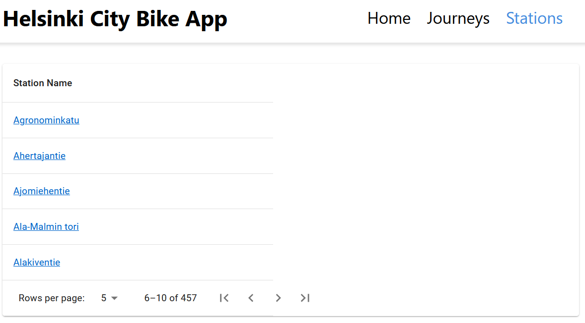

# Helsinki city bike app (Dev Academy pre-assignment)
This is the pre-assignment for the Solita Dev Academy Finland 2023.

## Technologies used
* React
* MUI
* Node
* Express
* MySQL

## How to run the project

### 1. Create a database and import data

Make sure you have MySQL installed. Open the MySQL Command Line Client and execute the following commands:

CREATE DATABASE citybikeapp;

USE citybikeapp;

Download dumped database from: https://drive.google.com/file/d/1Kbjd57ZFofJgz7aL-H_lzVg2u_9FfbVf/view?usp=sharing into location "C:\Program Files\MySQL\MySQL Server 5.7\bin".

Execute the following command in the MySQL Command Line Client:

mysql -u root -p citybikeapp < C:\Program Files\MySQL\MySQL Server 5.7\bin\citybikeappDB.sql;

The database is ready to be used.

### 2. Configuration

In the client/api folder you will find index.js file and in the backend folder you will find .env file. You can change these values if needed:

SERVER_URL (default is http://localhost:8800)

SERVER_PORT (default is 8800)

SERVER_HOST (default is localhost)

DATABASE_NAME (default is citybikeapp)

DATABASE_USER (your MySQL username)

DATABASE_PASSWORD (your MySQL password)

### 3. Install npm packages

Go into the base, client and backend folders one by one in your CLI and write the following command: npm i

### 4. Run backend and frontend

To run both frontend and backend, go to the base city-bike-app folder and run the command: npm run dev

By default backend will be run on the http://localhost:8800/ and frontend on the http://localhost:3000/

### Front-end

